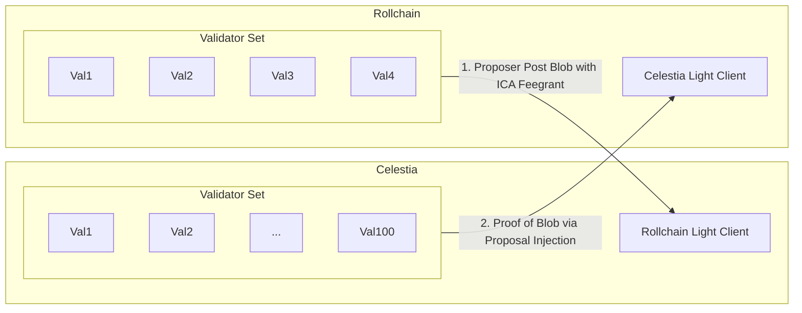
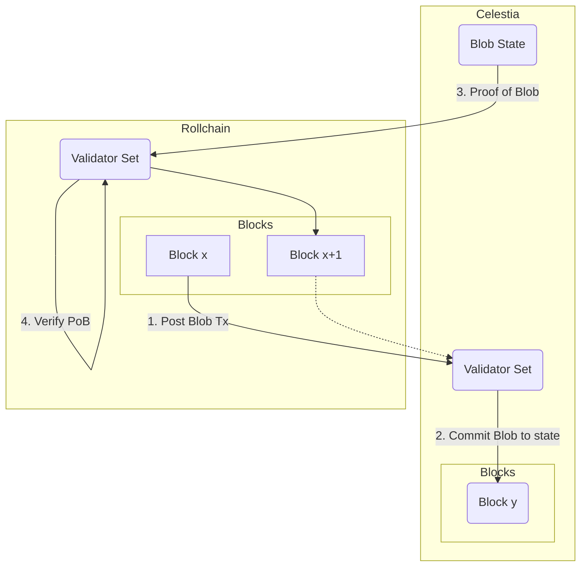

# Celestia Blob Cosmos SDK Module

This module enables posting block data to celestia via the proposing validator.

# 1. Introduction

### 1.1 Background

Using a Cosmos chain with a light client tracking Celestia with a proof-of-blob mechanism to confirm that data has been written to the DA within the trusting period allows a familiar architecture to be used with minor modifications, creating a viable path for not only green-field applications but also existing Cosmos chains that wish to take advantage of DA layer guarantees.

### 1.2 Purpose

This document aims to delineate the architecture required to modify a standard Cosmos chain in order to incorporate Celestia into the trust model, leveraging it for Data Availability with it’s decentralized validator set.

### 1.3 Scope

The scope encompasses the existing well-known Cosmos SDK app-chain components, the additional Celestia light client created at Genesis, the DA blob publish mechanism, light client update mechanism via Vote Extensions (VE), and proof-of-blob (PoB) mechanism.

# 2. Architecture

### 2.1 Design Overview

The proposed architecture provides an option for Rollup applications to use a standard Cosmos SDK app-chain on top of Celestia. This design entails:

- Tendermint mempool for transaction ingest and gossip
- Tendermint validator block proposals for transaction sequencing
- A light client on the Rollup tracking Celestia, created in the Rollup chain state during Genesis
    - Standard 07-tendermint light client
    - Optionally, DA light client expiration halts the chain. Alternatively for exploration: chain goes into a “recovery mode” where blocks continue to be produced but the only valid transactions are those that can recover the light client e.g. client substitution.
    - trusting period of the light client is no more than the data retention window on the DA (period during which [ShareCommitment](https://github.com/celestiaorg/celestia-app/blob/main/x/blob/README.md#generating-the-sharecommitment) blob-inclusion proofs can be generated)
- An RPC connection from the Rollup validators to the Celestia chain for:
    - Relaying ICA blob publish packets or broadcasting blob publish txs directly (covered in 4.2)
    - Block header queries to update the light client on the Rollup via Vote Extensions
    - [ShareCommitment](https://github.com/celestiaorg/celestia-app/blob/main/x/blob/README.md#generating-the-sharecommitment) blob-inclusion proof queries for Proof of Blob verification
- Rollchain SDK module:
    - **final-height** - non-skipped incremental height that has blob inclusion proven against the Celestia light client. Blocks at or below this height are considered final.
    - validator celestia account mapping - used to feegrant validators on Celestia for paying blob publish tx fees

### 2.2 Benefits

- It’s, “just a Cosmos chain”. A whole ecosystem of developers are already trained and ready to build with this architecture. Existing chains have a straightforward path to utilizing Celestia for DA.
- Secured by Celestia - the smaller validator set of the rollup has data security guarantees provided by the $500M of staked assets on the Celestia mainnet. The history of rollup chain block data is forever secured by the Celestia validator set.
- Rollchains will be IBC compatible out of the box with all other Cosmos SDK chains, as the 07-tendermint light client can be used both for both tracking counterparties on the rollup, and tracking the rollup on the counterparties.
- Provides a scaling path for existing Cosmos chains to reduce the size of their validator set, enabling faster block times and a slimmer security budget.
- Fullnodes can sync directly from Celestia or from rollchain p2p network.

# 3. Technical Breakdown

### 3.1 Light Client Updates via Proposer Injection

Validators have a background go-routine running that is constantly querying the Celestia RPC for new block headers and ShareCommitment proofs, always proof height+1 so that validators can pre-cache proofs instead of having to fetch proofs at pre-vote time. A trusted height is kept in the chain state of the rollup within a new **x/tiablob** module. During the proposal, the proposing validator packages and signs a client update message in addition to [ShareCommitment](https://github.com/celestiaorg/celestia-app/blob/main/x/blob/README.md#generating-the-sharecommitment) proofs for heights since the last trusted height that can be verified against the apphash for the new client state height. During block commit, assuming there is consensus on the new state and the proofs are valid, the client state is updated on the rollup and the trust height is incremented within the tiablob module state. The final/trusted height will never skip heights to ensure that all data has been published to DA.

### 3.2 Validator blob publish fees

[MsgPayForBlobs](https://github.com/celestiaorg/celestia-app/blob/main/x/blob/README.md#messages) is required as part of the blob publish transaction on Celestia to pay for the inclusion of the data on Celestia. Additionally, the transaction execution fees must be paid.

An ICA on Celestia controlled by the rollchain protocol feegrants all of the validator's Celestia addresses. The proposing validator publishes any outstanding block data above the last proven height to Celestia. This is paid for by the ICA account via feegrant. The proposer also relays any unrelayed ShareCommitment proofs back to the rollchain.

Validators need to generate a Celestia account key within their keyring. ICA feegrant authorization to the validator accounts can be performed automatically in protocol using the validators Celestia accounts registered within the state of the tiablob module. This then only requires a single Celestia account (the ICA) to stay funded, which can be monitored by all of the validators of the rollup. Similarly, If it is an HA PoA deployment, there is only one wallet to monitor.

## Appendix 1

### 1.1 - Rollchain ↔ Celestia Security Model

### 1.2 - Rollchain ↔ Celestia Data Flow

